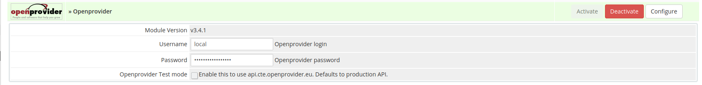
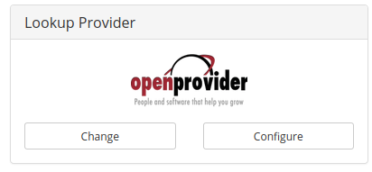
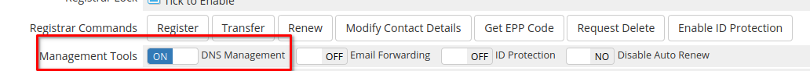

# Domain Module for WHMCS

The Openprovider WHMCS module integrates conveniently with your [Openprovider account](https://rcp.openprovider.eu/registration.php#/registration), allowing you to automate many domain provisioning and management tasks, such as registration, renewal, deletion, and updates to contact details.

The module keeps domain expiration dates and auto renew settings synchronized between your WHMCS installation and Openprovider account, making sure the correct domains get renewed each day.

Additionally, the module allows you to use the Openprovider API to check for domain availability, increasing performance over the default domain availability check. 

Features

- Domain registrations and transfers
- Domain updates
- Domain availability lookup service
- Domain name spinning service
- Extended Synchronization of domain data
- Domain status synchronization reports
- Renew domains upon transfer completion


# Install and configure the Openprovider module

## Copy files into the module directories

- Upload the contents of `/modules/registrars/openprovider` from this repository to  `<your WHMCS directory>/modules/registrars/openprovider`
- Upload the contents of `/includes/hooks/` to `<your WHMCS directory>/includes/hooks`
- If you do not have the file ` <your WHMCS directory>/resources/domains/additionalfields.php` then add the example version from `resources/domains/additionalfields.php`
  - Otherwise add the following lines to the top of your `additionalfields.php` file. : 
```
if (function_exists('openprovider_additional_fields'))
    $additionaldomainfields = openprovider_additional_fields();
``` 
- [Optional] Upload `<Module directory>/modules/addons/openprovider` to `<WHMCS directory>/modules/addons`
## Basic Configurations

- Navigate to **Setup > Products/Services > Domain Registrars** and activate Openprovider. 



1. Enter the credentials for an API user.
2. Click **Save**
3. Navigate to **Setup > Products/Services > Domain Pricing** and select Openprovider as registrar for the TLD which you want to sell via Openprovider
   

That's all you need to do to get started selling domains from Openprovider! Additional configurations can be found below.


# Optional and Advanced configurations

### Import prices

- [Import and sync TLD prices from Openprovider](docs/TLD_Pricing_sync_Utility.md)  

### Lookup provider and domain name spinning

- Click "change" to Choose Openprovider as the lookup provider
 

- Choose "configure" to select namespinning options

### Enable premium domains

First Make sure that the currency that you are using to pay Openprovider is configured in **Setup > Payments > Currencies** (and click on **Update Exchange Rate**). Otherwise WHMCS will not use premium fee correctly, potentially meaning that your client will pay significantly less for the domain.

1. Enable **Support premium domains**
2. Configure premium pricing and margins
3. In the Advanced configuraiton file of the module ( `/modules/registrars/openprovider/configuration/advanced-module-configurations.php`) find the parameter "OpenproviderPremium" and set to **true**

### Allow additional DNS records

If you plan on allowing your end users to edit their own DNS records, and want them to be able to create all record types supported by Openprovider, you can make some modifications to the WHMCS templates as described here:

- [Modify WHMCS templates to allow all DNS record types which Openprovider supports](docs/custom_DNS_management_options.md)

### Allow end users to edit DNSSEC records

- Upload the contents of `<Module directory>/custom-pages` to the top level of your WHMCS folder i.e. `<your WHMCS directory>/`
- Navigate to the **target client profile > domains** select the desired domain and under **management tools** activate **"DNS management"** 

- The below option will appear in the domain details page of the chosen domain


### Configure TLDs which don't allow locking (.nl, .be, .eu, .es)

Not all TLDs allow domain locking, but WHMCS assumes that this option is available for all domains. As a result, end users will see a warning "you domain is unlocked" when they visit the domain details page. You can hide this option with the following changes to your template files.

- Open `clientareadomaindetails.tpl` in the template you are using and replace

```
{if $lockstatus eq "unlocked"}
```

with

```
{$domainSplit = "."|explode:$domain}
{$domainTld = $domain|replace: $domainSplit.0 : ""}
{if $lockstatus eq "unlocked" && $domainTld != '.eu' && $domainTld != '.nl' && $domainTld != '.be'  && $domainTld != '.es'}
```

### Configure tag management

Set up tag management to send custom emails to the end users of your resellers.

- [Configuration instructions can be found here](docs/associate_tags_with_customers.md)

### Configure the Openprovider cron sync

If you are concerned that the "out of the box" domain sync included by WHMCS is not sufficient and would like more granular control over domain sync, you can configure the Openprovider sync script. 

- [Configuration instructions can be found here](docs/configure_openprovider_cron_sync.md)

### Decide whether to use Openprovider Auto-renew

Various options exist for managing domain renewals. A detailed explanation of your options [can be found here](docs/auto_renew_logic.md)

### Custom DNS Templates

- Create a custom DNS template in the Openprovider control panel (**DNS management > Manage DNS templates**), 
- Put the name of it [in the advanced configuration file](docs/advanced_configurations.md) and any domain created with the Openprovider nameservers will have a DNS zone automatically created on Openprovider nameservers according to your DNS template.

### Troubleshooting

If there are any connectivity issues with Openprovider, or API commands are not working for some reason, the first troubleshooting step should be to look at the API logs. Navigate to **Utilities > Logs > Module Logs** ​or `<WHMCS directory>/admin/systemmodulelog.php`​ and you can find the raw API commands being sent and received by your WHMCS modules. The responses should contain some information about how the problem can be solved.

\

### FAQ

Common issues and solutions for them can be found [here](https://support.openprovider.eu/hc/en-us/articles/360009201193).
