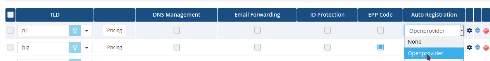
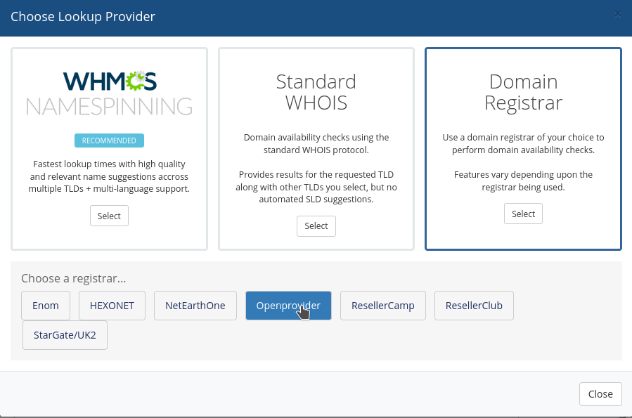

# Domain Module for WHMCS 8.x

**Please note that this is a beta version of the Openprovider domain registrar module (compatible with PHP 8.1 and WHMCS 8.9.0, latest stable release) which is still undergoing final testing before its official release.**

**If you notice any bugs or lack of functionality or
other problems, please report it to [Openprovider Support team](https://support.openprovider.eu/hc/en-us/articles/360001674667-Contact-Openprovider-Support) immediately with all details (reseller_id, error details, screenshots, WHMCS, PHP version details, etc.) so that we can rectify issues accordingly. Your help in this regard is greatly appreciated!** 

## Introduction
The Openprovider WHMCS module integrates conveniently with your [Openprovider account](https://cp.openprovider.eu/signup), allowing you to automate domain provisioning and management tasks, such as registration, renewal, deletion, updates to contact details, etc.

The module keeps domain expiration dates, status and auto renew settings synchronized (on all Pending Transfer, Pending Registration, and Active status domains) between your WHMCS installation and Openprovider account, making sure the correct domains get renewed each day.

Additionally, the module allows you to use the Openprovider API to check for domain availability, increasing performance over the default domain availability check. 

Features

- Domain registrations, renewals and transfers
- Domain updates
- TLD Price Sync
- Domain availability lookup service
- Domain name spinning service
- Domain Sync using WHMCS native cron
- Domain status synchronization reports
- Renew domains upon transfer completion
- DNSSEC management
- DNS management (Openprovider Standard DNS)
- Nameserver management (for domains registered through Openprovider)


# Install and configure the Openprovider module

## Copy files into the module directories

- Upload the contents of `/modules/registrars/openprovider` from this repository to  `<your WHMCS directory>/modules/registrars/openprovider`
- Upload the contents of `/includes/hooks/` to `<your WHMCS directory>/includes/hooks`
- If you do not have the file ` <your WHMCS directory>/resources/domains/additionalfields.php` then add the example version from `resources/domains/additionalfields.php`
  - Otherwise add the following lines to the top of your `additionalfields.php` file. : 
```
<?php
if (function_exists('openprovider_additional_fields'))
    $additionaldomainfields = openprovider_additional_fields();
```
- [Optional] Upload `<Module directory>/modules/addons/openprovider` to `<WHMCS directory>/modules/addons`
## Basic Configurations

- Navigate to **Configuration >> System Settings >> Domain Registrars** and activate Openprovider module. 


1. Enter API credentials (username and password, not hash) of your user. Ensure API access is enabled in the Openprovier control panel for the credentials you are using. Please refer to [this KB article](https://support.openprovider.eu/hc/en-us/articles/360015453220-How-to-enable-API-access) if API is not enabled already.
2. Click **Save**
3. Navigate to **Configuration >> System Settings >> Domain Pricing** and select Openprovider as registrar for the TLD which you want to sell via Openprovider
   

That's all you need to do to get started selling domains from Openprovider! Additional configurations can be found below.


# Advanced configurations

### Import Domain prices

- [Import and sync TLD prices from Openprovider](docs/TLD_Pricing_sync_Utility.md)  

### Lookup provider and domain name spinning

- Navigate to **Configuration > System Settings > Domain Pricing** or, prior to WHMCS 8.0, **Setup > Products/Services > Domain Pricing**
- Under **Lookup Provider** Click **Change** to Choose Openprovider as the lookup provider




- Choose "configure" to select namespinning options

### Enable premium domains (optional)

First make sure that the currency that you are using to pay Openprovider is configured in **Configuration >> System Settings >> Currencies (prior to WHMCS 8.0, Setup >> Payments >> Currencies)** and click on **Update Exchange Rate**. Otherwise WHMCS will not use premium fee correctly, potentially meaning that your client will pay significantly less for the domain.

1. Enable **Support premium domains**
2. Configure premium pricing and margins
3. In the Advanced configuration file of the module ( `/modules/registrars/openprovider/configuration/advanced-module-configurations.php`) find the parameter "OpenproviderPremium" and set to **true**


### Allow additional DNS records

If you plan on allowing your end users to edit their own DNS records, and want them to be able to create all record types supported by Openprovider, you can make some modifications to the WHMCS templates as described here:

- [Modify WHMCS templates to allow all DNS record types which Openprovider supports](docs/custom_DNS_management_options.md)

### Allow end users to edit DNSSEC records

- Navigate to the **target client profile > domains** select the desired domain and under **Management Tools** activate **"DNS Management"** 

- The below option will appear in the domain details page of the chosen domain


- **Notes**:
  -  If you experience any difficulty accessing the DNSSEC page, please manually upload/copy the contents of `<Module directory>/registrars/openprovider/custom-pages` (dnssec.php file) to the top level of your WHMCS folder (i.e. `<your WHMCS directory>/`)
  -  If you see the menu option as "**dnssectabname**" as shown in the screenshot below, copy the folder `<Module directory>/lang/overrides` to `<your WHMCS directory>/lang/` folder. 
 

### Configure TLDs which don't allow locking (.nl, .be, .eu, .es)

Not all TLDs allow domain locking, but WHMCS assumes that this option is available for all domains. As a result, end users will see a warning "you domain is unlocked" when they visit the domain details page. You can hide this option with the following changes to your template files.

- Open `clientareadomaindetails.tpl` in the template you are using and replace

```
{if $lockstatus eq "unlocked"}
```

with

```
{$domainSplit = "."|explode:$domain}
{$domainTld = $domain|replace: $domainSplit.0 : ""}
{if $lockstatus eq "unlocked" && $domainTld != '.eu' && $domainTld != '.nl' && $domainTld != '.be'  && $domainTld != '.es'}
```

### Configure tag management

Set up tag management to send custom emails to the end users of your resellers.

- [Configuration instructions can be found here](docs/associate_tags_with_customers.md)

### Decide whether to use Openprovider Auto-renew

Various options exist for managing domain renewals. A detailed explanation of your options [can be found here](docs/auto_renew_logic.md)

### Custom DNS Templates

- Create a custom DNS template in the Openprovider control panel (**DNS management > Manage DNS templates**), 
- Put the name of it [in the advanced configuration file](docs/advanced_configurations.md) and any domain created with the Openprovider nameservers will have a DNS zone automatically created on Openprovider nameservers according to your DNS template.

### Troubleshooting

If there are any connectivity issues with Openprovider, or domain operations from WHMCS are not working/showing errors, the first troubleshooting step should be to enable module logging, reproduce the issue/error and review the System Module Debug Log. 

Navigate to **Configuration > System Logs > Module Log** (prior to WHMCS 8.0, **Utilities > Logs**)​ and you can find the raw API commands being sent and received by your WHMCS modules. The responses should contain some information about how the problem can be solved. 


Please refer to WHMCS documentations: [Troubleshooting Module Problems](https://docs.whmcs.com/Troubleshooting_Module_Problems) and [System Logs](https://docs.whmcs.com/System_Logs)

Important: Only enable module logging for troubleshooting or testing purposes. At all other times, make certain that you set Module Logging to Off.

### FAQ

Common issues and solutions for them can be found [here](https://support.openprovider.eu/hc/en-us/articles/360009201193-WHMCS-Frequently-asked-questions).


### [DEPRECATED] Configure the Openprovider cron sync

This feature is deprecated since version 5.3 of the Openprovider domain module, and is not recommended for versions WHMCS 8+. We suggest that you use the WHMCS native domain sync and do not use the Openprovider custom sync for  WHMCS 8 and higher.

- [Configuration instructions can be found here](docs/configure_openprovider_cron_sync.md)
