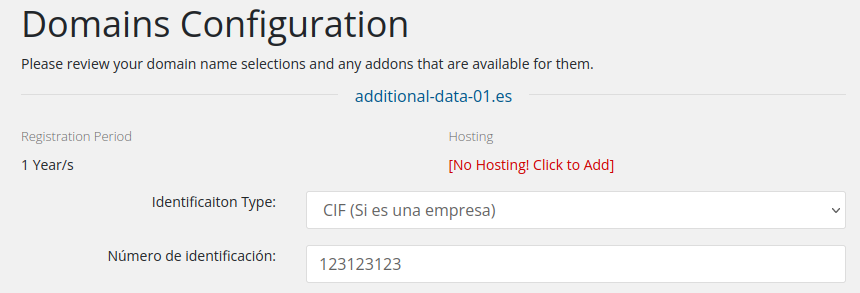
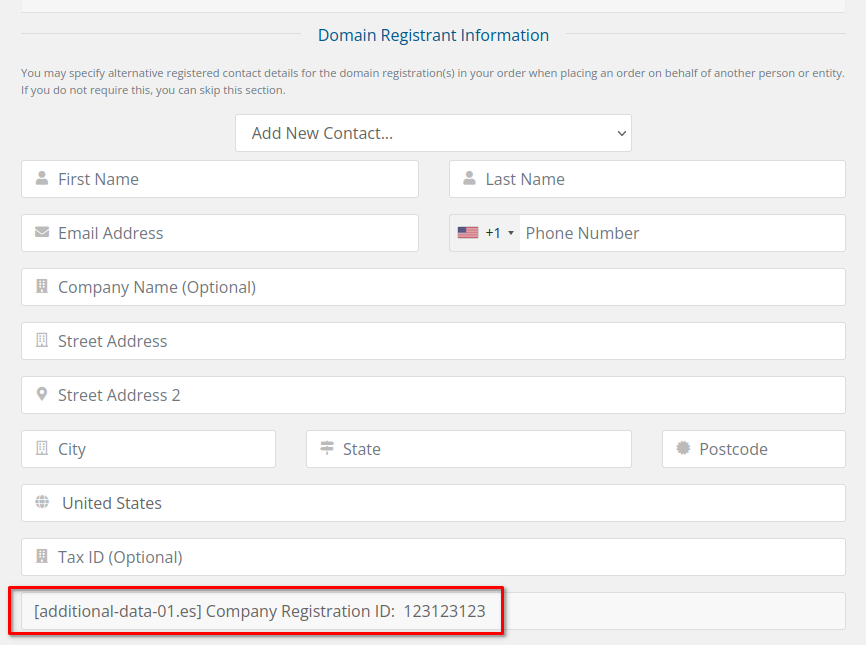
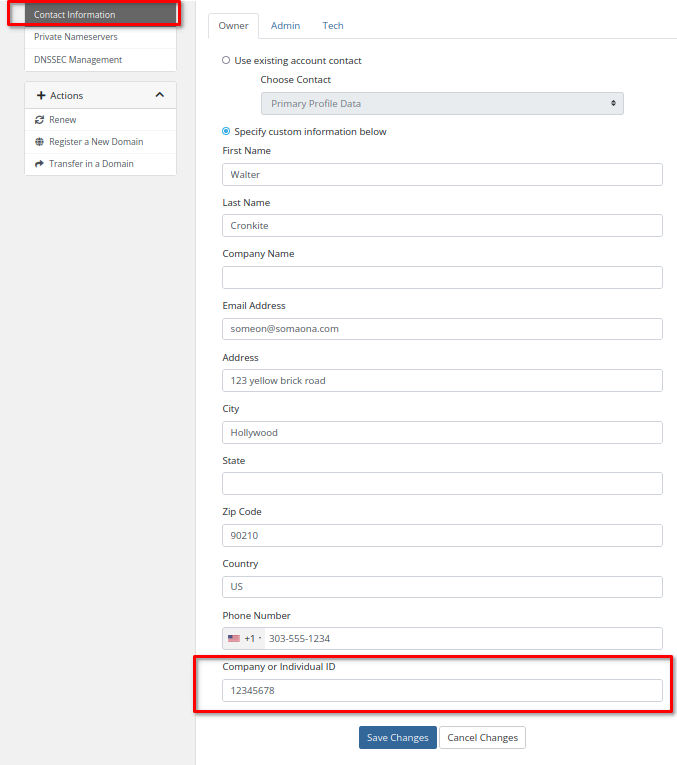

# Advanced VAT and ID number handling for .es and .pt

WHMCS uses a straightforward paradigm for collecting additional domain information or additional contact information when registering domains. The usual case is for additional data to be provided at the domain creation stage by the end user. That additional data is connected with the WHMCS domain object and if domain registration is triggered by WHMCS, this additional data is used by the registrar module, in this case, Openprovider. 

While this method works in in the simplest case, it fails in cases where the end user wants to change the additional data after the domain has already been registered. In this case, the end user must contact the WHMCS administrator, who must update the data in the Openprovider control panel. 

In the case of .es and .pt domains, the end user must supply some form of tax id, whether they are a corporate entity or private individual. The advanced option for  .es and .pt domains allows this particular piece of data to be tied directly to the end user object in WHMCS, and when the domain

#### Activating the feature

- Navigate to the advanced configuration file `modules/registrars/openprovider/configuration/advanced-module-configurations.php` and set the  value to `true` 
- For the desired TLD (one or both of .es and .pt) set the registrar in WHMCS to "Openprovider"
- Ensure that the Openprovider `openprovider_additional_fields()` function has been correctly installed according to the README

#### Creating a domain with additional domain data

- When the end user tries to create an .es or .pt domain they will have the option to choose `Tipo de identificación`which can either be `DNI (Si es un particular)` or `CIF (Si es una empresa)` note that the names of these values cane be changed in the file `modules/registrars/openprovider/configuration/additionalfields.php`

- While completing the purchase, if the end users attempts to create an new contact, the data will already be included in the profile

#### Updating a domain with the additional data

Once a domain has already been created, the end user can update the additional domain data by navigating to the "Contact information" of the domain details page. At the bottom will be a data field "Company or Individual ID" which can be updated:

