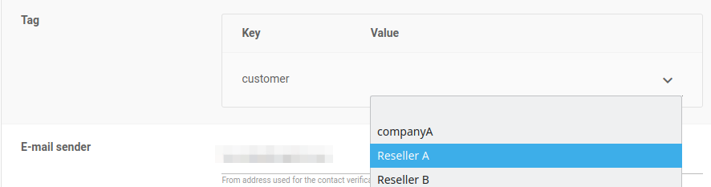
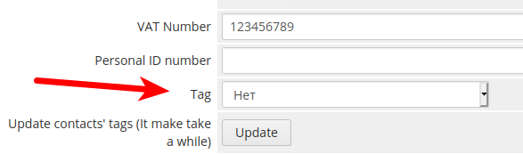

Coming soon!! this will be included in version 3.5 of the module

# Send custom emails to different clients with tags

The Openprovider whitelabel email functionality is a powerful tool which allows you to send custom emails to clients and end users with any design and branding you choose. From the [settings page](https://cp.openprovider.eu/account/overview-configuration.php) in you account, you can see all the emails which can be customized. 

With tags, you can expand this tool with even a higher amount of granularity. By assigning tags to your clients, you can send custom emails to them and their end users. Many potential options for how this could be used. One option is offering custom branding to your clients who are also resellers. 

### Initial setup 

- Navigate to [tags management](https://cp.openprovider.eu/web/action/index#/tag/overview) ( account > settings > tag management) in your control panel, and create tags in your Openprovider account for each of your client segments
- From the [settings](https://cp.openprovider.eu/web/action/index#/account/settings/overview) in your control panel, create a custom email for each segment, and select the applicable tag

- In the WHMCS control panel, open the profile of each client who should be in a particular segment, and assign the desired tag and click update to ensure all the contacts connected with this client are assigned with this tag

- To remove tags from a client, select "no tags" in the client profile area and click update. Tags will be removed from the client and all associated contacts 

